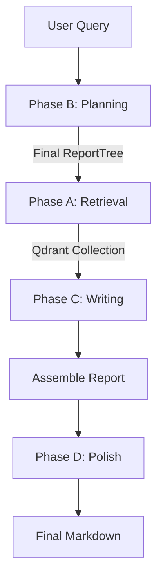

# Singularity Architecture

Current-state architecture reference for the implemented system.

This document describes only the present codebase behavior and boundaries.

---

## 1) System Overview

Singularity has two runnable orchestration paths:

1. **Phase-5 pipeline (primary production path)**  
   Entry: `agents/orchestrator/pipeline.py:run_pipeline`
2. **Legacy DAG orchestrator (compatibility path)**  
   Entry: `agents/orchestrator/runner.py:run_orchestrator`

Both paths use common infrastructure:
- `skills/` registry and tiered skill modules,
- `tools/` external adapters,
- `llm/` provider clients and router,
- `models/` contracts,
- `vector_store/` for chunk storage and retrieval.

---

## 2) Runtime Entry Points

### 2.1 Orchestrator CLI

Path: `agents/orchestrator/cli.py`

- Runs phase-5 `run_pipeline` with `--strength` (and BYOK `--api-key`).
- Writes the final Markdown report to `final_report.md` in the working directory.

### 2.2 Chat REPL

Path: `agents/chat/cli.py`

- Uses `ChatAgent` with a **Thinker -> Executor** pattern.
- Thinker chooses `chat` vs `research` mode.
- Research mode delegates to the same phase-5 `run_pipeline`.

---

## 3) Primary Path: Phase-5 Pipeline

## 3.1 Phase order

The pipeline executes in strict phase order:

1. **Phase B**: Structure planning (3 managers + 1 lead)
2. **Phase A**: Retrieval (tree-informed fanout + ingest)
3. **Phase C**: Writing (bottom-up section workers)
4. **Phase D**: Polish (deterministic cleanup + LLM polish)

Retrieval intentionally runs **after** planning so retrieval queries are section-targeted.

### 3.2 High-level flow

### 3.3 Internal components by phase

- **Phase B**
  - `ReportManagerAgent` x3 in parallel (`agents/report_manager/agent.py`)
  - `ReportLeadAgent` synthesis (`agents/report_lead/agent.py`)
  - `SKILL_DOCS.planner_context(...)` injects skill contracts into manager prompts
- **Phase A**
  - `Retriever.run(...)` (`agents/retriever/retriever.py`)
  - Query plan generation, sanitizer pass, skill fanout
  - `VectorStoreClient` ingest of chunk embeddings
  - Optional source gate filtering (`agents/source_gate/gate.py`)
- **Phase C**
  - `ReportWorkerAgent` writes tree nodes bottom-up
  - Qdrant retrieval budget scales by strength and node depth
  - Leaf augmentation loop (bounded by `StrengthConfig`)
- **Phase D**
  - `PolishAgent` (`agents/polish.py`) for formatting and visual cleanup

### 3.4 Phase-5 serialized vs parallelized work

**Serialized**
- B -> A -> C -> D phase boundaries
- Lead after managers
- Depth levels in writing pass

**Parallel**
- Manager proposals in phase B
- Retrieval skills in phase A
- Same-depth worker nodes in phase C
- Section polish operations in phase D

---

## 4) Compatibility Path: Legacy DAG Orchestrator

Path: `agents/orchestrator/runner.py`

Legacy loop:
1. Planner creates plan DAG
2. Executor runs topological waves
3. Gap analysis inspects node statuses
4. Optional replan round
5. Loop detection and stop conditions

This path remains useful for direct skill-DAG execution and replan-loop behavior.

---

## 5) Skill System Architecture

## 5.1 Registration model

Core files:
- `skills/base.py`
- `skills/registry.py`

Mechanism:
1. Skill classes subclass `SkillBase`.
2. `SkillBase.__init_subclass__` registers concrete classes into internal registry.
3. Tier package imports trigger class definitions.
4. `_register_real_skills()` instantiates classes into `SKILL_REGISTRY`.
5. `TIER1_SKILLS` is derived from retrieval-skill type checks.

### 5.2 Tier model

- **Tier 1 Retrieval (18 skills)**: acquire source evidence.
- **Tier 2 Analysis (18 skills)**: reasoning and transformation.
- **Tier 3 Output (8 skills)**: output formatting and presentation.

### 5.3 Skill documentation integration

Core file: `skills/skill_docs.py`

`skill.md` is actively used in two places:
- Thinker menu generation (`USE/NOT` compressed hints)
- Report-manager planning context (full contracts for selected skills)

This makes skill documentation an executable planning artifact, not passive text.

---

## 6) Data and Contract Boundaries

Core package: `models/`

Primary contract groups:
- `plan.py`: plan/tree execution shapes
- `context.py`: shared run state (`ExecutionContext`)
- `output.py`: retrieval/analysis/output return contracts
- `chunk.py`: vector-store and citation record shapes
- `enums.py`: status and issue enums

Design choice: keep strict contract types at module boundaries to reduce implicit dict coupling.

---

## 7) Retrieval and Vector Architecture

## 7.1 Vector store client responsibilities

Core file: `vector_store/client.py`

- collection lifecycle per run (`run_<id>`),
- chunk upsert with bounded retry,
- semantic search with credibility filter,
- topic cache index for cross-run reuse,
- TTL cleanup for stale collections.

### 7.2 Connection policy

- Default mode: server-backed Qdrant (`QDRANT_URL`).
- Explicit dev fallback: in-memory mode (`QDRANT_FORCE_IN_MEMORY=1` or constructor flag).
- Server connection failures raise explicit runtime errors unless in-memory was explicitly requested.

### 7.3 Retrieval query sanitation

Core file: `agents/retriever/retriever.py`

Every generated query is sanitized before tool calls:
- strips annotation artifacts,
- enforces max query length,
- deduplicates near-identical queries.

---

## 8) LLM Architecture

### 8.1 Routing layer

Core file: `llm/router.py`

Model-id prefix routing:
- `grok-*` -> `GrokClient`
- `deepseek-*` -> `DeepSeekClient`
- otherwise -> `GeminiClient`

### 8.2 Phase-5 role-model mapping

Configured in `agents/orchestrator/config.py`:
- planner, managers, worker analysis, source gate: mini model class
- lead and worker write: higher-quality model class
- polisher: mini model class

This is a cost/quality split by role, not a single-model strategy.

---

## 9) Citation and Context Subsystems

### 9.1 Citation subsystem

Core file: `citations/registry.py`

- source registration,
- stable citation id generation,
- URL dedup behavior,
- bibliography rendering styles.

### 9.2 Context budgeting subsystem

Core file: `context/budget.py`

- builds bounded upstream context strings,
- prioritizes direct dependencies over indirect summaries,
- enforces total budget cap.

---

## 10) Scaling Controls

Core file: `agents/orchestrator/strength.py`

`StrengthConfig` is the central scaling policy for:
- retrieval skill count,
- queries per skill,
- min results per query,
- section count range,
- qdrant retrieval k by depth,
- augmentation iteration and web-escalation limits,
- expected LLM call estimate.

This creates a single runtime dial for depth, breadth, and cost profile.

---

## 11) Operational Artifacts

- Orchestrator CLI output: `final_report.md` (local working directory)
- Cached run collections in Qdrant: `run_<id>`

---

## 12) Architectural Trade-offs (Current)

### 12.1 Chosen strengths

- Clear phase boundaries in primary path.
- Typed model contracts across modules.
- Skill registry extensibility with minimal central edits.
- Explicit vector-store failure policy in non-dev operation.
- Documentation-driven skill planning context (`skill.md` integration).

### 12.2 Current constraints

- Multi-agent + multi-phase flow increases orchestration complexity.
- Registry and tier loading still depend on import-time side effects.
- Heuristic markdown parsing in `SkillDocs` requires consistent `skill.md` structure.
- Persistent vector mode requires external Qdrant availability.

---

## 13) File-Level Map (Most Relevant)

- `agents/orchestrator/pipeline.py` — phase-5 orchestration
- `agents/orchestrator/runner.py` — legacy DAG loop
- `agents/retriever/retriever.py` — retrieval planning and fanout
- `agents/report_manager/agent.py` — manager proposals
- `agents/report_lead/agent.py` — final tree synthesis
- `agents/report_worker/agent.py` — section writing
- `agents/polish.py` — final polish phase
- `skills/registry.py` — runtime skill registry
- `skills/skill_docs.py` — skill documentation runtime integration
- `vector_store/client.py` — Qdrant adapter and cache lifecycle
- `models/__init__.py` + submodules — contract package

