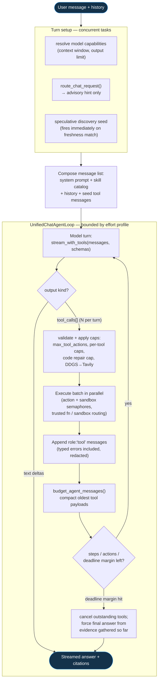
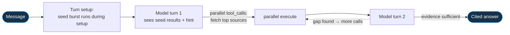
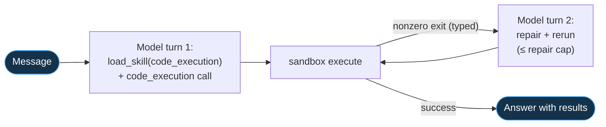
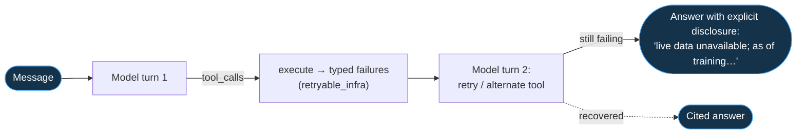
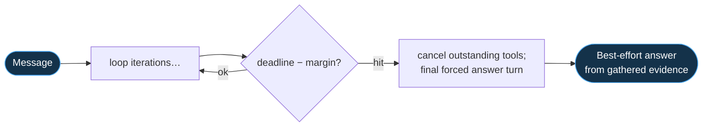

# Singularity

Singularity is being rebuilt around a new API and engine. This branch contains
the API v2 data foundation: a portable FastAPI + SQLAlchemy schema that starts
on SQLite and can later move to PostgreSQL.

## Current scope

The API owns the durable data model, SQLite development lifecycle, local object
store, and HTTP route templates. Production uses Alembic before API/worker
startup. The bounded research path is executable through the CLI and ARQ
worker; other engine work remains behind stable service boundaries.

Identity has two modes, selected by `SINGULARITY_AUTH_MODE`:

- `bearer` (default) — Google-federated browser authentication plus automatic
  CLI device authentication. Both receive a short-lived access JWT plus a
  rotating refresh token; every user-scoped endpoint requires
  `Authorization: Bearer <access_jwt>`. The CLI route needs only the server's
  JWT secret, while Google login also needs its OAuth client id.
- `header` — the temporary `X-User-ID` boundary for local curl and the
  deterministic test suite. Create a user with `POST /users`, then send its ID
  in that header.

Both modes resolve to the same `User` through a single dependency
(`api/dependencies.py`), so routers and service calls are identical regardless
of mode.

Browser clients are enabled by configuring `SINGULARITY_CORS_ALLOW_ORIGINS`
(comma-separated). It is empty by default, leaving CORS off.

## Application logs

The API and research worker emit ordinary console logs plus a rotating file log.
Every chat turn and research run includes stable `user_id`, `chat_id`, `run_id`,
and message/report identifiers where available, so one flow can be followed with
`grep`. Configure the detail level in `.env.production` (or `.env` locally):

```dotenv
# Step boundaries and identifiers; user/model payloads are omitted.
SINGULARITY_LOG_MODE=steps

# Or: steps plus complete inputs, outputs, research payloads, and chat deltas.
# SINGULARITY_LOG_MODE=full
```

`full` mode contains user prompts, model responses, and retrieved research
content. Restrict access to it and choose a retention policy appropriate for
production data. Files rotate at 10 MB with five backups by default; override
`SINGULARITY_LOG_MAX_BYTES` and `SINGULARITY_LOG_BACKUP_COUNT` when needed.

Production Compose stores `/app/logs/api.log` and `/app/logs/worker.log` in the
named `application_logs` volume, so the files survive container replacement.
The quickest live view uses container stdout and works without entering a
container:

```bash
docker compose -f docker-compose.prod.yml logs -f --tail=200 api worker
```

To inspect or filter the persistent files directly:

```bash
docker compose -f docker-compose.prod.yml exec api tail -f /app/logs/api.log
docker compose -f docker-compose.prod.yml exec worker tail -f /app/logs/worker.log
docker compose -f docker-compose.prod.yml exec worker grep 'run_id="RUN_ID"' /app/logs/worker.log
```

`docker compose down` keeps the named volume; `docker compose down -v` deletes
it. For centralized production retention, ship container stdout to the host's
logging driver or a log platform and keep the file volume as the local fallback.

## Data model

```text
User
├── Chats (one-to-many)
│   ├── Messages (one-to-many)
│   └── Chat summaries (one-to-many)
├── Usage account (one-to-one)
│   ├── Daily / weekly / monthly rollups (one-to-many)
│   └── Usage history events (one-to-many)
├── Reports (one-to-many)
│   ├── Report versions (one-to-many)
│   └── Chats (one-to-many, optional report link)
├── Research runs (one-to-many, optionally linked to a report)
└── Refresh tokens (one-to-many)
```

Important design choices:

- UUIDs are stored as portable 36-character strings, avoiding SQLite-specific
  behavior while preserving stable IDs for a later PostgreSQL move.
- Core relationships are normalized and protected by foreign keys, unique
  constraints, and query indexes.
- Usage has one durable account per user, queryable day/week/month rollups, and
  append-only event history for future billing and analytics.
- JSON extension fields exist on each domain model for additive features without
  forcing a premature schema migration.
- Chats may have no report, or may be linked to one report; a report can have
  many chats.
- Report-version content is written through a small object-store interface. It
  uses the local filesystem now and has an isolated future adapter point for
  Supabase S3.

## Route templates

All routes are available in the generated OpenAPI UI at `/docs`.

| Resource | Routes | Current behavior |
| --- | --- | --- |
| System | `GET /health`, `GET /storage/health` | Reports application and configured storage health. |
| Users | `POST /users`, `GET/PATCH/DELETE /users/me` | Creates users and their one-to-one usage account; deletion is a soft delete. |
| Chats | `GET/POST /chats`, `GET/PATCH/DELETE /chats/{id}` | Creates, lists, updates, and archives chats. |
| Auth | `POST /auth/google`, `POST /auth/cli-device`, `POST /auth/refresh`, `POST /auth/logout` | Supports interactive Google login and zero-interaction CLI device sessions, issues an access JWT + rotating refresh token, and revokes tokens (family-wide on reuse). |
| Messages | `GET/POST /chats/{id}/messages`, `POST /chats/{id}/messages/stream` | Persists the user message, streams the real engine `UnifiedChatAgentLoop` reply as `accepted`/`delta`/`completed` SSE events, and persists the assistant reply. |
| Summaries | `GET/POST /chats/{id}/summaries` | Stores durable chat-summary checkpoints. |
| Reports | `GET/POST /reports`, `GET /reports/{id}`, `GET /reports/{id}/stream` | Creates and lists report metadata; the stream endpoint replays the latest stored report version over SSE (or `report.pending` when none exists yet). |
| Versions | `GET/POST /reports/{id}/versions`, `GET /reports/{id}/versions/{version_id}/content` | Saves version content into local object storage and exposes it as Markdown. |
| Research | `GET/POST /research/runs`, `GET /research/runs/{id}`, `POST /research/runs/{id}/cancel`, `GET /research/runs/{id}/events` | Creates bounded LangGraph research runs, persists replayable events, and optionally dispatches them to the ARQ worker. |
| LLM / BYOK | `GET/POST/PATCH /llm/credentials`, `GET /llm/credentials/{id}/models`, `POST /llm/completions` | Stores encrypted Groq credentials, discovers models with that credential, and runs request-scoped completions. |

`POST /chats` is limited to 3 requests/second per user, message sends (normal
and streamed together) to 3 requests/second per user, and `POST /reports` to
1 request/second per user. Exceeding a limit returns `429` with `Retry-After`.
The current limiter is in-process; move its counters to Redis before running
multiple API instances.

## Bounded research workflow

`engine/research_workflow/` contains the LangGraph state contracts and bounded runtime:

- QA may add at most two research nodes per section per cycle.
- Each research node may make at most four external tool calls: one search,
  two page fetches, and one optional recovery call.
- Strength controls the overall cycle, node, and runtime caps; it does
  not increase either per-section QA suggestions or per-node tool calls.
- `api/research_worker.py` is the ARQ entrypoint. It assembles the BYOK LLM
  adapter, Modal executor, QA reviewer, vector scope, structured writer, and
  LangGraph checkpointer directly from the persisted run configuration.
- Use `Last-Event-ID` when reconnecting to `/research/runs/{id}/events`; events
  are replayed from the durable `research_run_events` table.
- The API rejects new research runs with `503` if its worker is disabled, so a
  request is never accepted into a queue that has no consumer.

Run the deterministic CLI smoke workflow without a provider key, Modal
deployment, or frontend:

```bash
python -m engine.research_workflow.cli --demo --strength 1 --output-dir .artifacts/research \
  "How does bounded research work?"
```

The deterministic smoke command writes `research-document.json` and
`research-report.md`. In the terminal REPL, use `/mode` and choose **Research**;
each subsequent plain-text prompt runs the live LangGraph workflow with the
selected provider model and deployed Modal web tools, then renders the complete
report directly in the terminal. The hosted API owns Modal, Redis, the research
worker, durable events, and the report artifact; the CLI only streams progress
and the completed Markdown. It requires a saved key for the selected provider.
Choose **Chat** in `/mode` to return to normal conversational chat.
For live API execution, set the credential encryption key, Groq pricing rates,
and `SINGULARITY_RESEARCH_WORKER_ENABLED=1`; production Compose starts the
Alembic migration job and ARQ worker automatically.

### Real-inference test mode (curl only)

A gated test mode runs the full production path — real BYOK LLM calls and real
Modal web tools — but shrinks a run to the minimum needed to prove the wiring:
exactly **one node, one `web_search`, and one `web_fetch`**, with no QA cycle.
It exists so you can pay for one cheap real run instead of a full report.

It is off by default and requires **both** a server flag and a per-request
field, so it can never engage in normal operation:

- Server: `SINGULARITY_RESEARCH_TEST_MODE=1` (in addition to the usual
  `SINGULARITY_RESEARCH_WORKER_ENABLED=1`, a running Redis + ARQ worker, and a
  deployed Modal function with `SINGULARITY_MODAL_ENABLED=1`).
- Request: `"test_mode": true` in the `POST /research/runs` body.

If `test_mode` is sent while the server flag is off, the run is rejected with
`403` (never silently upgraded to a full run). When enabled, the minimal
profile is applied regardless of the requested `strength`.

```bash
# Server started with:
#   SINGULARITY_AUTH_MODE=header SINGULARITY_RESEARCH_WORKER_ENABLED=1 \
#   SINGULARITY_RESEARCH_TEST_MODE=1 SINGULARITY_MODAL_ENABLED=1 uvicorn api.main:app
# plus a running Redis, ARQ worker (api/research_worker.py), and deployed Modal function.

USER_ID=$(curl -s -X POST localhost:8000/users \
  -H 'Content-Type: application/json' -d '{"display_name":"RT"}' | jq -r '.id')

CRED_ID=$(curl -s -X POST localhost:8000/llm/credentials \
  -H 'Content-Type: application/json' -H "X-User-ID: $USER_ID" \
  -d '{"provider":"<provider>","api_key":"<your_real_key>","default_model_id":"<model_id>"}' | jq -r '.id')

RUN_ID=$(curl -s -X POST localhost:8000/research/runs \
  -H 'Content-Type: application/json' -H "X-User-ID: $USER_ID" \
  -d "{\"query\":\"What is retrieval-augmented generation?\",\"provider_credential_id\":\"$CRED_ID\",\"test_mode\":true}" \
  | jq -r '.id')

# Stream the run to completion (real LLM + 1 search + 1 fetch):
curl -N "localhost:8000/research/runs/$RUN_ID/events" -H "X-User-ID: $USER_ID"
```

## Backend SSE verification

Start the API in the `header` identity mode so the `X-User-ID` walkthrough
works without a Google token: `SINGULARITY_AUTH_MODE=header uvicorn
api.main:app --reload`. Create a temporary local user and resources (these
commands require `jq`):

```bash
USER_ID=$(curl -s -X POST http://localhost:8000/users \
  -H 'Content-Type: application/json' \
  -d '{"display_name":"SSE Test"}' | jq -r '.id')

CHAT_ID=$(curl -s -X POST http://localhost:8000/chats \
  -H 'Content-Type: application/json' \
  -H "X-User-ID: $USER_ID" \
  -d '{"title":"Streaming chat"}' | jq -r '.id')

REPORT_ID=$(curl -s -X POST http://localhost:8000/reports \
  -H 'Content-Type: application/json' \
  -H "X-User-ID: $USER_ID" \
  -d '{"title":"Streaming report"}' | jq -r '.id')
```

Use `curl -N` to disable client-side buffering and watch events arrive:

```bash
curl -N -X POST "http://localhost:8000/chats/$CHAT_ID/messages/stream" \
  -H 'Content-Type: application/json' \
  -H "X-User-ID: $USER_ID" \
  -d '{"content":"Show me a streamed response","message_data":{"effort":"high"}}'

curl -N "http://localhost:8000/reports/$REPORT_ID/stream" \
  -H "X-User-ID: $USER_ID"
```

The chat stream runs the shared bounded `UnifiedChatAgentLoop`, so the chat
must have an active BYOK credential (create one with `POST /llm/credentials`
and pass its id as `provider_credential_id` when creating the chat); without
one the stream endpoint returns `422`. The report stream replays the latest stored report
version, emitting a single `report.pending` event when a report has no version
yet. `SINGULARITY_SSE_DUMMY_DELAY_SECONDS` (default `0.15`) still paces the
per-chunk delay for the report replay.

Chat effort is a hard ceiling, not a requirement to spend every step. Instant,
Medium, High, and Ultra allow at most 4/10/18/30 model turns, 6/16/36/72 logical
tool actions, 2/4/8/12 concurrent actions, and 4,096/12,288/24,576/49,152 output
tokens respectively. The model stops the moment it has enough verified evidence
— a simple question costs one model call at every tier.

## Terminal engine

The REPL lives independently in `engine/cli` and mounts terminal agents through
a small adapter registry. The distributable CLI is a thin client for the
hosted Singularity API: database, auth-session bootstrap, Redis, research
workers, and Modal tools stay server-managed. Install and start it without a
project `.env`:

```bash
pipx install .
singularity
```

For repository development, `python -m engine.cli` remains equivalent. On first
launch, use `/key`, choose **Set or replace key**, and enter the selected
provider key in the hidden prompt. That is the only end-user setup. The CLI
saves the selected provider/model/effort alongside the key in the private
global configuration.

Inside the REPL, plain text streams a chat response. `/provider`, `/models`,
`/effort`, and `/key` open arrow-key selectors; `/status`, `/reset`, `/clear`,
`/help`, and `/quit` manage the current session. New sessions default to
`medium` effort. Groq, DeepSeek, and OpenRouter are supported. Provider keys,
the selected provider/model/effort, and renewable device-session state are persisted globally in
`~/.config/singularity/terminal.json` with private user-only permissions; it is
never written to the repository. By default, chat and research execute directly
from this checkout, and `python -m engine.cli` loads `.env` for its Modal tool
configuration. Set `SINGULARITY_CLI_BACKEND=api` only when you intentionally
operate a separately deployed API backend; that mode uses
`SINGULARITY_API_URL` (or its configured default) and owns persisted chats.

The hosted API resolves the encrypted credential and model for each request,
retrieves the model's live context/output limits, preserves the user message,
and trims only optional context. Provider deltas travel to the CLI through the
API's SSE contract and are rendered as they arrive; plaintext BYOK values are
never returned by the API.

## Groq BYOK

The application never stores a Groq key in an LLM provider object. A user adds
their key once through `POST /llm/credentials`; it is encrypted at rest using
`SINGULARITY_CREDENTIAL_ENCRYPTION_KEY`. Each model-list or completion request
loads and decrypts the selected credential only in memory, creates a temporary
Groq client, then discards the client and key reference.

`POST /llm/completions` accepts a credential ID and optional model ID, never an
API key:

```json
{
  "message": "Explain this architecture",
  "provider_credential_id": "cred_123",
  "model_id": "openai/gpt-oss-20b"
}
```

The resolved model uses this precedence: request model → selected chat model →
credential default model → `SINGULARITY_GROQ_FALLBACK_MODEL`. Every completion
validates the resolved model through Groq's authenticated Models API before it
runs. Set `SINGULARITY_CREDENTIAL_ENCRYPTION_KEY` to a stable Fernet key before
accepting credentials; changing it makes existing ciphertext undecryptable.

The default test suite uses only real local API, database, and filesystem
dependencies. The Groq end-to-end test is intentionally opt-in because it
makes real provider requests: set `SINGULARITY_RUN_LIVE_TESTS=1`, provide
`SINGULARITY_TEST_GROQ_API_KEY`, and run `pytest -m integration`.

## Modal trusted tool deployment

Deploy the trusted tool Function separately from the API after authenticating
the Modal CLI outside this repository:

```bash
modal deploy engine/modal_app/chat_tools.py --env main
```

The deployed app is `singularity-chat-tools` and its Function is
`execute_chat_tool`. Provision the named `singularity-tool-providers` secret in
Modal for optional external tool-provider credentials. Do not put Groq/BYOK,
database, internal API, deployment, or Modal-control credentials in that
secret. The terminal client sends only validated skill-scoped invocation data
and enforces its lower effort timeout locally; the Function itself has a
420-second ceiling. To run the separate deployed-function smoke test, set
`SINGULARITY_RUN_MODAL_TESTS=1` and run `pytest -m integration`.

Trusted chat operations now include `web_search`, guarded `web_fetch`,
`browser_render`, `calculator`, and `current_time`, alongside the existing
research providers and parsers. `web_search` discovers URLs; `web_fetch` reads
and extracts one public HTTP page; `browser_render` is the JavaScript fallback.
URL-reading operations reject private, local, reserved, link-local, embedded-
credential, non-HTTP, and nonstandard-port targets.

General web discovery attempts DDGS once per agent run. An exception, empty
result, or blocked response permanently routes later attempts in that run to
Tavily. Configure `TAVILY_API_KEY` in the Modal tool-provider secret so the
fallback is always available. Independent searches and fetches execute in
bounded parallel bursts; completed evidence is retained when another action
fails.

Repository inspection, generated dataset analysis, and general code execution
are deliberately excluded from the trusted Function. The skill router may
select them, but the execution router sends them only to separate no-secret
Modal Sandbox adapters: repository inspection permits only public GitHub clone
traffic and predefined inspection operations, while dataset analysis has
networking blocked and receives only a CSV plus generated Python. Code execution
writes a bounded file set and runs one argv-style command in a network-blocked
ephemeral workspace; nonzero exits are observations the planner may repair and
rerun within the effort cap. Production
vector retrieval is also excluded from CLI and Modal; it executes through the
authenticated API `RetrievalService` after relational ownership checks.

## LangSmith observability

The CLI chat agent uses LangSmith's standalone SDK directly; it does not use
LangChain or LangGraph. Once configured, each chat turn records nested spans
for local context selection, prompt budgeting, tool planning and Modal tool
calls, Groq model lookup and streaming generation, and local compaction.

Set these values outside source control:

```bash
LANGSMITH_TRACING=true
LANGSMITH_API_KEY=...
LANGSMITH_PROJECT=singularity-dev
```

`LANGSMITH_ENDPOINT` is optional for a self-hosted deployment. By default,
Singularity records only hashes, counts, durations, and operational metadata.
Set `SINGULARITY_LANGSMITH_CAPTURE_CONTENT=true` only in an approved
development environment to include sanitized messages and final outputs. The
adapter never captures Groq/BYOK keys, database credentials, raw tool
arguments, or raw provider errors, and LangSmith credentials are never sent to
Modal. Tracing is fail-open: unavailable observability cannot interrupt chat.

For machine-consumed responses, include `structured_output` with a JSON Schema.
The API accepts only Groq strict-mode models (`openai/gpt-oss-20b` and
`openai/gpt-oss-120b`), requires every field to be marked required with
`additionalProperties: false`, sends Groq `json_schema` with `strict: true`,
then parses and validates the returned JSON against the same schema before
responding. It rejects unsupported models, invalid strict schemas, malformed
JSON, and schema-invalid output.

## Groq failure handling

Provider failures never expose a Groq API key or upstream error body. The LLM
API returns a stable error object with `code`, `message`, and `retryable`.
Rate limits return `429` and pass Groq's `Retry-After` value through; temporary
network/provider/capacity failures return retryable `503`; invalid credentials,
permission failures, rejected requests, and exhausted credits return actionable
non-retryable `422`. The completion layer does not automatically retry a
generation because a connection failure can be ambiguous—the provider may have
already processed it. A future durable job queue should retry only errors marked
`retryable`, using an idempotency key.

## Local development

```bash
python3 -m venv .venv
source .venv/bin/activate
pip install -r requirements.txt

# Optional: defaults to sqlite+aiosqlite:///./singularity.db
export SINGULARITY_DATABASE_URL=sqlite+aiosqlite:///./singularity.db
export SINGULARITY_STORAGE_ROOT=./data/objects

# Bearer auth (default) needs both; set a Google OAuth client id and a JWT
# secret. Use SINGULARITY_AUTH_MODE=header to fall back to the X-User-ID flow.
export SINGULARITY_GOOGLE_CLIENT_ID=...
export SINGULARITY_JWT_SECRET=...

# Allow a browser client (empty by default = CORS off):
export SINGULARITY_CORS_ALLOW_ORIGINS=http://localhost:3000

uvicorn api.main:app --reload
```

The database tables are created automatically in development. Later, before
using a shared PostgreSQL deployment, introduce versioned migrations from this
clean baseline instead of importing the removed v1 migration history.

## Verification

```bash
python -m pytest tests/database/test_schema.py -q -o addopts=

# Full existing test suite:
python -m pytest -q
```

## Workflows

Singularity has two engine workflows behind the API: **Chat** (a bounded,
tool-augmented conversational turn) and **Research** (a multi-agent, DAG-based
report pipeline running on LangGraph). The flowcharts below trace every branch
each one can take — routing decisions, retries, fallbacks, and failure exits —
so the full behaviour is visible without reading the source.

### Chat workflow (unified agent loop)

A chat turn is **one native tool-calling agent loop**
(`engine/chat/agent_loop.py`): the same model that answers decides which tools
to call, receives full (budgeted) results as native `role: "tool"` messages,
can emit many tool calls in a single turn (executed in parallel), and streams
the final answer from the same loop. Deterministic heuristics
(`engine/chat/freshness.py`) are advisory: a freshness match seeds a
speculative discovery burst and adds a time-sensitive hint, but never gates
the turn. Effort profiles, execution routing, redaction, and citation handling
bound the loop as guardrails.

#### Components and methods

| Component | Replaced | Responsibility |
| --- | --- | --- |
| `engine/chat/agent_loop.py` — `UnifiedChatAgentLoop.stream()` | `ChatRuntime.stream()` + `BoundedChatToolLoop.run()` + `ChatAgent.stream()` | Owns the whole turn: message-list state, bounded iteration, tool dispatch, final answer streaming. |
| `LLMProvider.stream_with_tools()` | `plan_tool_call()` | One provider call per model turn that yields streamed answer deltas and/or a terminal batch of complete tool calls (natively parallel). `stream_chat()` remains for text-only turns (tools disabled, forced final answer). |
| Concurrent turn setup | serial routing → budget → capability lookup | Model-capability resolution (6h-TTL cached) and the speculative two-search discovery seed run as tasks before the first model turn. |
| `engine/chat/catalog.py` — full skill catalog + `load_skill(skill_id)` meta-tool | `select_skills()` 3-skill keyword shortlist | System prompt lists a one-line summary of **every** chat-capable skill; the model calls `load_skill` to pull full instructions on demand (progressive disclosure). |
| `route_chat_request()` (advisory mode) | mandatory fail-closed routing | A freshness match seeds the discovery burst and adds a "time-sensitive" hint; it never fails the turn. Hard failure remains only for explicit, unsimulatable tool commands ("run this code") with tools disabled. |
| Typed tool-error taxonomy | `_web_fetch_fallback()` URL regex | Tool failures return typed tool messages (`retryable_infra` / `permanent` / `empty_result`) so the model chooses retry, alternate tool, or explicit disclosure. |
| `budget_agent_messages()` | `budget_chat_prompt()` + `format_tool_context()` string merge | Fits the full message list (system + history + tool messages) per model turn: oldest tool payloads compact first, then the `<context>` block, then the output budget; message structure is never broken. |
| Effort profiles (`effort.py`), `RoutedChatToolExecutor`, redaction, URL-dedup citations | unchanged | Turn/action/parallelism/timeout ceilings, trusted-function vs sandbox routing with retries, credential redaction, untrusted-data framing. |

Keyword step budgeting (`choose_agent_step_budget`) is gone: the loop starts
each turn with the full effort ceiling available and a per-turn budget line in
the system prompt; the model stops when it has enough evidence — the caps
*are* the budget. A durable turn-checkpoint store (resume tool results across
dropped SSE connections) is planned but not yet implemented.

#### Unified pipeline



#### Flow types

Every request archetype travels the same loop; only the entry state and the
model's tool decisions differ.

**1. Conversational turn** (no heuristic match, model plans no tools):


One model call total — strictly cheaper than the retired planner-then-answerer
two-call minimum.

**2. Fresh-evidence turn** (freshness heuristic matched):



The seed's "zero planning cost" property is preserved; follow-up fetches now
batch in one model turn instead of one per planning round-trip.

**3. Explicit tool turn** ("run this code", "search arxiv for …"):



Skill selection is the model's choice from the full catalog — no keyword gate
required to reach arXiv, SEC, or sandbox tools.

**4. Degraded turn** (time-sensitive, but tools fail or are disabled):



Replaces the old `ToolEvidenceUnavailable` dead end. The only remaining hard
failure is an explicit tool command with Modal disabled.

**5. Deadline soft-landing** (long turn approaching the effort time cap):



`ChatRuntimeLimitExceeded` is now raised only when even the forced answer
cannot complete inside the run cap — never after gathered evidence could still
be synthesized.

The retry ladder inside every model turn: provider errors retry with backoff
only before the first visible output (a partial answer is never duplicated),
and an empty stream from a reasoning model retries once at low reasoning
effort before failing with `provider_empty_stream`.

### Research workflow

Research is a LangGraph state machine (`engine/research_workflow/langgraph_runtime.py`)
driven by a team of LLM collaborators (`agents.py`). **Strength (1 Quick / 2
Standard / 3 Deep)** selects a `RunCaps` profile that scales QA cycles, node
count, runtime, fetches, and token budgets. The graph plans from multiple
perspectives, resolves each node against live tools, reviews section coverage
in bounded QA cycles, and finally writes a cited, validated report — degrading
to a directly-assembled fallback report rather than failing whenever an
optional model pass breaks.

```mermaid
flowchart TD
    Begin([Query + strength 1/2/3]) --> Caps["RunCaps.for_strength()<br/>cycles, nodes, runtime,<br/>fetch &amp; token budgets"]
    Caps --> Deadline{{"outer run deadline<br/>(max_runtime_seconds)"}}
    Deadline --> Polish

    subgraph Graph["LangGraph parent graph"]
        direction TB

        Polish["polish_prompt<br/>LLMPlanner.polish_prompt()<br/>clarify objective, audience, constraints"] --> PlanBranch{"planner type<br/>(by strength)"}
        PlanBranch -->|"Quick: DirectResearchPlanner"| DirectNode["single node = exact user query<br/>(zero planning completion)"]
        PlanBranch -->|"Standard/Deep: LLMPlanner"| Perspectives["parallel_planners<br/>coverage / evidence-risk / narrative<br/>3–5 nodes each (parallel)"]

        DirectNode --> Lead
        Perspectives --> Lead["plan_lead<br/>LLMLead.merge()<br/>bounded merge → ResearchDAG<br/>(caps.max_nodes hard bound)"]
        Lead --> LeadEmpty{"any nodes?"}
        LeadEmpty -->|no| RootNode["inject fallback root node"]
        LeadEmpty -->|yes| Resolve
        RootNode --> Resolve

        Resolve["resolve_frontier<br/>resolve_frontier(): ready nodes"] --> PerNode

        subgraph PerNode["Per node: BoundedResearchResolver"]
            direction TB
            Discovery["domain_discovery_tools()<br/>route to ≤2 domain tools<br/>+ general web_search"] --> Fetch["fetch promising sources<br/>(≤ caps.max_fetches)<br/>Modal dispatch, 3 retries on infra error"]
            Fetch --> Rank["rank_evidence()"]
            Rank --> Answer["LLMAnswerer<br/>synthesize cited notes<br/>+ unresolved_gaps"]
            Answer --> Records["build source_records / evidence_ids<br/>(dedup by URL)"]
        end

        Records --> AfterResearch{"route_after_research<br/>cycle &lt; caps.qa_cycles?"}
        AfterResearch -->|"no (or Quick: 0 cycles)"| Write
        AfterResearch -->|yes| QA["qa_sections<br/>LLMQA.review() per section"]

        QA --> QAFail{"provider failure?"}
        QAFail -->|yes| QASkip["mark skipped, keep evidence<br/>(never discard retrieved work)"]
        QAFail -->|no| QAGaps["accept ≤ N gap suggestions<br/>pass/fail each section"]

        QASkip --> AfterQA
        QAGaps --> AfterQA{"route_after_qa<br/>new ready gap-nodes?"}
        AfterQA -->|"yes → research the gaps"| Resolve
        AfterQA -->|no| Write

        Write["write_report<br/>LLMWriter.write()"] --> Outline{"outline pass<br/>succeeds?"}
        Outline -->|no| Single["_write_single_call()<br/>one-shot writer"]
        Outline -->|yes| Sections["per-section body completions<br/>(parallel, 1 repair retry each)<br/>Sections → Subsections → Sub-subsections"]

        Sections --> AnySection{"any valid<br/>section?"}
        AnySection -->|no| Single
        AnySection -->|yes| Assemble["assemble ResearchDocument<br/>backfill references"]

        Single --> Validate
        Assemble --> Validate{"validate_document()<br/>passes?"}
        Validate -->|no| FallbackDoc["_fallback_document()<br/>directly-assembled cited report"]
        Validate -->|yes| GoodDoc[valid document]
    end

    FallbackDoc --> Markdown
    GoodDoc --> Markdown["to_markdown()"]
    Markdown --> Report([Cited research report])

    Deadline -. deadline hit .-> TimeoutFail[["TimeoutError<br/>run reached deadline"]]

    classDef fail fill:#4a1414,stroke:#ff6b6b,color:#fff;
    classDef terminal fill:#14324a,stroke:#4dabf7,color:#fff;
    class TimeoutFail fail;
    class Begin,Report terminal;
```



Progress at every phase (`planning → researching → reviewing → writing`) is
emitted as structured events and appended to a per-run diagnostics JSONL file,
so a live run can be followed step by step (see **Application logs** above).
