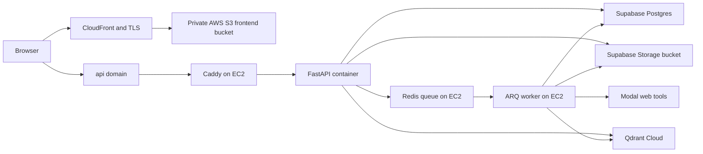

# Singularity deployment plan: EC2, Supabase, and AWS S3

## 1. Target outcome

Deploy Singularity as three independently managed layers:

1. **AWS EC2:** Caddy, FastAPI, Redis, and one ARQ research worker.
2. **Supabase:** PostgreSQL for relational data and LangGraph checkpoints, plus a private Storage bucket accessed through Supabase's S3-compatible API for report content.
3. **AWS S3 + CloudFront:** a static export of the Next.js frontend, served over HTTPS from a private S3 bucket.

The recommended public endpoints are:

- `https://app.<domain>` -> CloudFront -> private AWS S3 frontend bucket
- `https://api.<domain>` -> EC2 Elastic IP -> Caddy -> FastAPI

Redis, the ARQ worker, and the Supabase credentials remain private. Nothing should expose Redis port 6379 to the internet.



## 2. Repository findings that affect deployment

The repository already contains the correct service boundaries, but the current production files are not ready for this target architecture:

- `api/research_queue.py` dispatches `run_research_job` through Redis, and `api/research_worker.py` exposes `WorkerSettings` with `max_jobs = 1` and a four-hour job timeout.
- `engine/research_workflow/checkpoint.py` automatically selects the PostgreSQL LangGraph checkpointer when `DATABASE_URL` starts with `postgres`.
- `api/storage/s3.py` and `api/storage/factory.py` already provide an S3-compatible object-store adapter.
- `docker-compose.prod.yml` still runs local PostgreSQL and the Node frontend. Both must be removed from the EC2 stack for this deployment.
- The Compose file enables Redis AOF but does not mount `/data`; a container replacement can therefore discard the queue state.
- Redis currently uses `allkeys-lru`. Queue keys must not be evicted; production should use `noeviction` and alert before memory exhaustion.
- The Compose file is labelled for a 1 GB `t3.micro`, while its declared API, worker, Redis, Caddy, and frontend limits already total about 1.1 GB before the OS and Docker overhead. Even after moving PostgreSQL and the frontend off EC2, 1 GB is too narrow for the research worker.
- `docker-compose.prod.yml` and `Dockerfile.prod` build `NEXT_PUBLIC_API_URL`, but the frontend reads `NEXT_PUBLIC_API_BASE`. Google login reads `NEXT_PUBLIC_GOOGLE_CLIENT_ID`, which is not currently passed into the frontend build.
- The frontend is client-driven and has no route handlers or required server-side auth, so it is a good static-export candidate. It does use `next/image`, so the export must disable the default runtime image optimizer.
- The current local database contains application data and terminal research history. All research runs are already terminal (`completed` or `failed`), so old SQLite LangGraph checkpoint tables do not need to be made resumable in PostgreSQL.

## 3. Phase A: prepare the application for the target architecture

### A1. Split production Compose into EC2-only services

Keep only these services in the EC2 Compose file:

- `caddy`
- `migrate`
- `api`
- `redis`
- `worker`

Remove `postgres` and `frontend`. Change API, migration, and worker `DATABASE_URL` values to the Supabase URL supplied through the EC2 secret environment file. Do not interpolate a local database hostname.

Add a named Redis volume:

```yaml
redis:
  volumes:
    - redis_data:/data
  command: >
    redis-server
    --appendonly yes
    --appendfsync everysec
    --maxmemory 256mb
    --maxmemory-policy noeviction
```

Keep Redis on the Compose network only; use `expose`, not a host `ports` mapping. The API and worker should use `REDIS_URL=redis://redis:6379/0`.

Add a real `deploy/Caddyfile` that proxies only the API domain to `api:8000`. The existing Compose file references this path, but the file is currently absent.

### A2. Make Supabase Storage production-safe

Keep the existing `S3ObjectStore`, but configure the S3 client for path-style addressing because Supabase's S3 examples require it. Use the direct Storage hostname:

```text
https://<project-ref>.storage.supabase.co/storage/v1/s3
```

Set:

```dotenv
SINGULARITY_STORAGE_BACKEND=s3
SINGULARITY_S3_BUCKET=singularity-reports
SINGULARITY_S3_ENDPOINT_URL=https://<project-ref>.storage.supabase.co/storage/v1/s3
SINGULARITY_S3_REGION=<supabase-project-region>
SINGULARITY_S3_ACCESS_KEY_ID=<server-only-access-key>
SINGULARITY_S3_SECRET_ACCESS_KEY=<server-only-secret>
```

The bucket should be private. These generated S3 keys bypass Storage RLS and must exist only in the EC2 secret store/environment, never in the frontend or a checked-in file.

Add an integration smoke test against a dedicated test bucket: put, head, get, checksum comparison, and delete. The current mocked tests do not prove endpoint/addressing compatibility.

### A3. Make the frontend statically exportable

Update `frontend/next.config.ts` to use:

```ts
const nextConfig: NextConfig = {
  output: "export",
  trailingSlash: true,
  images: { unoptimized: true },
  reactCompiler: true,
};
```

Standardize the public build variables:

```dotenv
NEXT_PUBLIC_API_BASE=https://api.<domain>
NEXT_PUBLIC_GOOGLE_CLIENT_ID=<google-oauth-client-id>
```

Remove obsolete frontend-only server variables such as `NEXTAUTH_SECRET`, `GOOGLE_CLIENT_SECRET`, and `INTERNAL_API_URL`; this frontend implements client-side Google ID-token exchange with the FastAPI backend and does not use NextAuth.

`npm run build` should produce `frontend/out/`. Treat both public values as compile-time configuration: changing either requires a new frontend build and upload.

### A4. Complete the production environment contract

The API and worker need the same durable secrets and service settings:

```dotenv
ENVIRONMENT=production
DATABASE_URL=postgresql+asyncpg://...
REDIS_URL=redis://redis:6379/0
SINGULARITY_AUTO_CREATE_SCHEMA=false
SINGULARITY_RESEARCH_WORKER_ENABLED=true
SINGULARITY_RESEARCH_TEST_MODE=false
SINGULARITY_AUTH_MODE=bearer
SINGULARITY_CORS_ALLOW_ORIGINS=https://app.<domain>
SINGULARITY_GOOGLE_CLIENT_ID=<same-public-google-client-id>
SINGULARITY_JWT_SECRET=<stable-random-secret>
SINGULARITY_CREDENTIAL_ENCRYPTION_KEY=<stable-existing-fernet-key>
SINGULARITY_LOG_MODE=steps
SINGULARITY_MODAL_ENABLED=1
SINGULARITY_MODAL_APP=singularity-chat-tools
SINGULARITY_MODAL_FUNCTION=execute_chat_tool
SINGULARITY_MODAL_ENVIRONMENT=main
QDRANT_URL=<qdrant-cloud-url>
QDRANT_API_KEY=<qdrant-cloud-key>
```

Also provide the Modal token pair and any required observability settings. Preserve the existing JWT secret and credential-encryption key during migration: changing the encryption key makes saved BYOK credentials unreadable, and changing the JWT secret invalidates existing access tokens.

Store production values in AWS Systems Manager Parameter Store or Secrets Manager and materialize a root-readable environment file during deployment. Do not copy the repository's placeholder `.env.production` to the server.

## 4. Phase B: provision Supabase

1. Create a Supabase project in the AWS region nearest the EC2 instance.
2. Create a private Storage bucket named `singularity-reports`.
3. Generate server-side S3 access keys and record the direct S3 endpoint and region.
4. Choose the database connection mode:
   - Prefer the direct connection for migrations and a persistent EC2 backend when the instance can reach Supabase over IPv6 or the project has the IPv4 add-on.
   - Otherwise use the Supavisor **session-mode** endpoint on port 5432 for this persistent EC2 deployment.
   - Do not default to transaction mode on port 6543. It is intended for transient/serverless clients and does not support prepared statements without extra driver configuration.
5. Require TLS in the database URL/configuration.
6. Run `alembic upgrade head` as the one-shot `migrate` service before starting either API or worker.
7. Let `AsyncPostgresSaver.setup()` create the PostgreSQL-specific LangGraph checkpoint tables on the first worker run; SQLite's `checkpoints` and `writes` tables are not schema-compatible migration targets.

## 5. Phase C: migrate current SQLite and report objects

Use a maintenance window and a purpose-built, repeatable migration command. Do not point production at SQLite and Supabase simultaneously.

### C1. Pre-migration backup and freeze

1. Put the current API in maintenance/read-only mode.
2. Stop the ARQ worker and verify that no run is `queued` or `running`.
3. Create a consistent SQLite backup with SQLite's backup command, not a raw copy of a live WAL database.
4. Archive `data/objects/` and record SHA-256 checksums.
5. Record row counts per application table.

### C2. Relational data transfer

1. Apply Alembic to an empty Supabase database.
2. Copy application tables in foreign-key order while preserving UUIDs, timestamps, JSON values, sequence numbers, encrypted credential ciphertext, and token hashes.
3. Migrate `research_runs` and `research_run_events`, but do not copy SQLite's LangGraph `checkpoints` and `writes` tables. The current runs are terminal, and the PostgreSQL saver owns a different checkpoint schema.
4. Either migrate refresh-token rows while preserving `SINGULARITY_JWT_SECRET`, or deliberately omit them and document that all users must sign in again. The safer operational default is a forced sign-in after cutover.
5. Compare source and target row counts and run foreign-key/orphan checks before cutover.

Recommended table order:

```text
users
llm_provider_credentials
usage_accounts
reports
chats
messages
chat_summaries
usage_rollups
usage_history
report_versions
research_runs
research_run_events
user_walkthroughs
refresh_tokens (only if sessions are retained)
```

### C3. Object transfer

For each `report_versions.content_uri`:

1. Read the referenced local object.
2. Upload it through the production `S3ObjectStore` using the same relative key.
3. Compare byte length and SHA-256 checksum.
4. Update `content_uri` from `local://...` to `s3://...` only after verification.

Migrate database-referenced objects, not every local file blindly; this avoids promoting orphaned development artifacts. After the transfer, verify every report version through the API content endpoint.

### C4. Cutover and rollback

1. Keep the SQLite backup and local object archive immutable.
2. Start the EC2 `migrate`, `redis`, `api`, and `worker` services against Supabase.
3. Run the smoke suite in Section 8.
4. Point `api.<domain>` to the EC2 Elastic IP only after the smoke suite passes.
5. If validation fails, stop EC2 services, restore the old API target, and reopen the original SQLite deployment. Do not accept writes on both systems during rollback.

## 6. Phase D: provision EC2

### D1. Instance and network

- Start with `t3.medium` (2 vCPU, 4 GiB) for headroom during long research jobs. `t3.small` (2 GiB) is the minimum reasonable smoke/staging size with `max_jobs = 1`; do not use `t3.micro` for production.
- Use an encrypted gp3 EBS root volume, approximately 30 GB initially.
- Allocate an Elastic IP.
- Security group:
  - TCP 443 from the internet.
  - TCP 80 from the internet only for redirect/ACME handling.
  - TCP 22 only from the operator's fixed IP, or omit it and use SSM Session Manager.
  - No public rules for 8000, 5432, or 6379.
- Attach an IAM role limited to reading the app's SSM/Secrets Manager paths and pulling its ECR image.

### D2. Runtime and release process

1. Install Docker Engine and the Compose plugin.
2. Build the backend image in CI and push an immutable commit-SHA tag to ECR. Avoid compiling the large Python/ML image on the production instance.
3. Pull a pinned image tag on EC2.
4. Materialize secrets, then run:
   - `docker compose ... run --rm migrate`
   - `docker compose ... up -d redis api worker caddy`
5. Configure Docker log rotation in addition to the application's rotating files.
6. Use `systemd` to start the Compose project after reboot.
7. Monitor `/health`, `/storage/health`, container restarts, Redis memory, queue depth, worker job failures, EC2 memory/disk, and Supabase connection usage.

Deploy API and worker from the exact same image tag so job payload and database contracts cannot drift.

## 7. Phase E: deploy the frontend to AWS S3

1. Create a dedicated private bucket such as `<project>-frontend-prod`; this is separate from the Supabase report bucket.
2. Keep S3 Block Public Access enabled and use CloudFront Origin Access Control.
3. Create a CloudFront distribution with HTTPS-only viewer behavior, compression, and `index.html` as the default root object.
4. Attach a viewer-request CloudFront Function that rewrites:
   - `/dashboard/` -> `/dashboard/index.html`
   - `/dashboard` -> `/dashboard/index.html`
   - the same pattern for other extensionless routes
5. Issue the frontend certificate in ACM `us-east-1`, attach `app.<domain>`, and add the DNS alias.
6. Add `https://app.<domain>` as a Google OAuth authorized JavaScript origin.
7. Build with the production public variables, then upload `frontend/out/`.
8. Give hashed assets a long immutable cache lifetime; give HTML a short/no-cache policy.
9. Invalidate HTML paths (or `/*` for the first simple release process) after upload.

Do not enable the public S3 website endpoint. The S3 website endpoint supports HTTP only; CloudFront with OAC keeps the bucket private and supplies HTTPS.

## 8. Verification gates

Deployment is complete only when all gates pass.

### Infrastructure

- Only ports 80/443 are publicly reachable on EC2.
- `docker compose ps` shows Caddy, Redis, API, and worker healthy/running.
- A container restart preserves Redis AOF data.
- API and worker resolve the same Supabase database and Redis instance.

### Database and storage

- `alembic current` reports the head revision.
- Application-table row counts match the migration manifest.
- Foreign-key/orphan checks return zero failures.
- `GET /storage/health` succeeds against Supabase Storage.
- Every migrated report version returns its original bytes/checksum.

### API, auth, and CORS

- `GET https://api.<domain>/health` returns success.
- Google sign-in from `https://app.<domain>` returns an API JWT pair.
- Requests from the frontend origin pass CORS; an unlisted origin fails.
- Refresh rotation and logout work after deployment.

### ARQ and research

- Create one gated test-mode research run.
- Confirm the API enqueues it in Redis and the ARQ worker changes it from `queued` to `running` to a terminal state.
- Stream events with `curl -N` and verify replay with `Last-Event-ID`.
- Confirm the report row is in Supabase Postgres, report bytes are in Supabase Storage, and vector ingestion reaches Qdrant Cloud.
- Restart the worker during a staging run and confirm PostgreSQL checkpoint resume behavior before enabling full production research.

### Frontend

- Direct loads and refreshes work for `/`, `/login/`, and `/dashboard/` through CloudFront.
- No frontend bundle contains database, Supabase S3, Google client-secret, JWT, Modal, or Qdrant secrets.
- Chat SSE and research SSE remain unbuffered end to end.

## 9. Recommended implementation order

1. Fix environment variable names and static-export the frontend locally.
2. Refactor production Compose to EC2-only services; add Redis persistence and the Caddyfile.
3. Add path-style Supabase S3 configuration and its live integration smoke test.
4. Provision Supabase and validate Alembic plus object-store health from a staging EC2 instance.
5. Build and test the SQLite/object migration command against a temporary Supabase project.
6. Provision the production EC2 host and deploy API, Redis, and ARQ with a pinned image.
7. Provision the private AWS S3 + CloudFront frontend and validate route rewrites.
8. Perform the maintenance-window migration and API DNS cutover.
9. Run all verification gates, then enable normal research submissions.
10. After an agreed rollback window, retire the old SQLite/object deployment but retain encrypted backups according to the retention policy.

## 10. Official operational references

- [Supabase database connection modes](https://supabase.com/docs/guides/database/connecting-to-postgres)
- [Supabase S3 authentication](https://supabase.com/docs/guides/storage/s3/authentication)
- [AWS secure static website with S3 and CloudFront](https://docs.aws.amazon.com/AmazonCloudFront/latest/DeveloperGuide/getting-started-secure-static-website-cloudformation-template.html)
- [AWS CloudFront Function for `index.html` URL rewrites](https://docs.aws.amazon.com/AmazonCloudFront/latest/DeveloperGuide/example_cloudfront_functions_url_rewrite_single_page_apps_section.html)
- [AWS CloudFront Origin Access Control for S3](https://docs.aws.amazon.com/AmazonCloudFront/latest/DeveloperGuide/private-content-restricting-access-to-s3.html)
