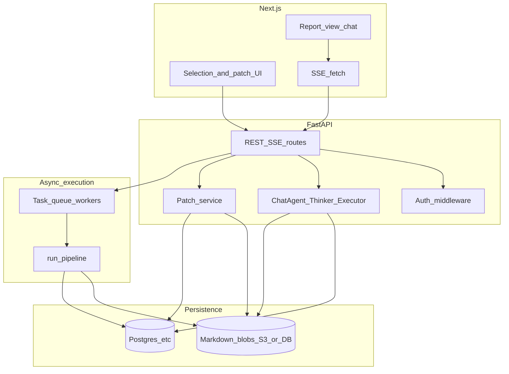

# Singularity platform (FastAPI + Next.js) — phased development plan

**Companion:** [docs/PLATFORM_DEVELOPMENT_GUIDE.md](docs/PLATFORM_DEVELOPMENT_GUIDE.md)

---

## Architecture (target end state)

---

## Phase dependency graph

```mermaid
flowchart LR
  PM1[Phase_-1_Core_Refactor_Done]
  P0[Phase_0_Context]
  P1[Phase_1_Foundation]
  P2[Phase_2_Research_jobs]
  P3[Phase_3_Report_QA]
  P4[Phase_4_Patch]
  P5[Phase_5_Memory]
  P6[Phase_6_Platform_UI]
  P7[Phase_7_Analytics]
  P8[Phase_8_Hardening]
  P9[Phase_9_Optional]

  PM1 --> P0
  P0 --> P1
  P1 --> P2
  P2 --> P3
  P3 --> P4
  P4 --> P5
  P5 --> P6
  P6 --> P7
  P7 --> P8
  P8 --> P9
```

---

## Phase -1 — Completed core architecture uplift

**Status:** Completed in recent major refactor.

**What is now in place**

- Skill auto-registration is driven by subclass registration and dynamic tier imports.
- Static system prompts are externalized into markdown files alongside agent code.
- Data contracts are modularized under `models/` (`plan`, `context`, `output`, `chunk`, `enums`).
- Vector store behavior is hardened (explicit fallback semantics, retries, centralized config, lifecycle cleanup).
- Architecture docs (`README`, `ARCHITECTURE.md`) reflect implemented behavior.

**Why this matters for frontend/backend work**

- The report engine internals are now stable enough to expose through API boundaries.
- Prompt and model contract separation reduces risk while wiring HTTP/SSE endpoints.
- Vector store reliability improvements reduce platform-level failure modes during async jobs.

---

## Phase 0 — Context and constraints

**Goal:** Align platformization scope now that the core engine refactor baseline is complete.

**Fixes vs today’s CLI**

- Persist **Report** + **ReportVersion**; reference by `report_id` / version, not in-memory `active_report_md`.
- No global `final_report.html`; versioned MD; Next renders (react-markdown + KaTeX); static HTML = export only.
- Research via **job queue**, not blocking HTTP.
- **SSE** (or WebSocket) for streaming; explicit event schema for plan / steps / tokens.
- Thread history from **DB** + **token budget**; do not use executor’s 5×200 truncation for API.
- **Auth** on every resource.

**Reuse from repo**

- `agents/chat/agent.py`, `thinker.py`, `executor.py`, `agents/orchestrator/pipeline.py` (`run_pipeline`), `agents/polish.py`, `render/html_report.py` (export). Keep agents as **libraries**; I/O in FastAPI services.

**Exit criteria:** Team agrees on phased order below; ADR for persistence stack chosen.

---

## Phase 1 — Foundation: persistence stack, domain model, auth baseline

**Goal:** Durable multi-tenant state and authenticated API shell.

**Deliverables**

- **Stack:** Postgres + SQLAlchemy 2 + Alembic (+ optional SQLModel); Redis; task queue choice (ARQ/RQ/Celery) + ADR; S3-compatible blobs when MD exceeds inline comfort.
- **Tables (minimum):** User, Report, ReportVersion (content or uri, version, etag/hash, metadata JSON), Thread, Message, ResearchJob.
- **FastAPI:** `get_current_user`, `get_db`, health check, OpenAPI `/v1`, CORS, structured logging + `request_id`.
- **Auth:** JWT validation (JWKS) for chosen provider (Clerk / Auth0 / NextAuth pattern); `user_id` on all tenant rows; **User** `last_login_at` / `last_active_at` stubs for Phase 7.
- **Platform baseline:** secrets via env/managed store; Sentry/OTel hooks; rate-limit placeholder (Redis) per IP/user.

**Exit criteria:** Migrations run in CI; authenticated user can create empty Report row; no business logic beyond CRUD smoke tests.

**Maps to todos:** `persistence-stack`, `domain-model`, `platform-baseline`, `fastapi-surface` (skeleton only).

---

## Phase 2 — Async research jobs

**Goal:** `run_pipeline` off the request thread; persisted report output.

**Deliverables**

- `POST /v1/research/jobs` → `job_id`; **idempotency** key on create.
- Worker runs `run_pipeline`; updates **ResearchJob** (status, attempts, errors, finished_at).
- On success: new **ReportVersion** with markdown (+ optional trace path).
- `GET /v1/research/jobs/{id}` for status; client polls or subscribes to completion (SSE/WS/redis pub optional in Phase 8).
- **No** long blocking HTTP.

**Exit criteria:** curl/httpx flow: create job → worker completes → report version readable by owner.

**Maps to todos:** `async-research`.

---

## Phase 3 — Report-grounded Q&A (HTTP + SSE)

**Goal:** Follow-up questions on a report with streaming; prefer report context; web/skills when needed.

**Deliverables**

- `POST /v1/threads` with `report_id` (+ optional pinned version).
- `POST /v1/threads/{id}/messages` with `Accept: text/event-stream`: events for **plan**, **step**, **token**, **done** (+ grounding metadata).
- **Thinker:** `report_qa` mode / prompt rules when thread has `report_id`.
- **Executor:** inject full report or **top-k `##` chunks**; remove CLI history truncation for API; optional real **skill_call** / **web_search** execution vs `_skill_summary` only.
- **Grounding:** citations / source tags in stream or final event.

**Exit criteria:** End-to-end: job completes → user asks question → answer streams; web used when plan includes it.

**Maps to todos:** `thinker-report-qa`, `executor-report-context`, `grounding-step`.

---

## Phase 4 — Selective patch + versioning + Next contract

**Goal:** User selection + instruction → new **ReportVersion**; concurrency-safe.

**Deliverables**

- `POST /v1/reports/{id}/versions/{v}/patch` with `selected_text`, optional `heading_slug` / `block_id`, `instruction`, `base_hash` / `If-Match`.
- **409** on version mismatch; **validation** of LLM output MD (basic AST / length).
- Run `agents/polish.py` programmatic fixes after apply.
- **Contract tests:** same heading slug algorithm in Python and TypeScript.
- Next: selection UX, diff preview, retry on 409.

**Exit criteria:** Patch creates version N+1; concurrent patch conflicts handled.

**Maps to todos:** `next-selection-contract`, `patch-versioning`.

---

## Phase 5 — Conversation memory and context budget

**Goal:** Long threads without blowing context; report remains anchor.

**Deliverables**

- Load **Message** history server-side; **token budget** (report slice + recent turns + tool output).
- **Rolling thread summary** job (async); fallback if summary fails (truncate old turns once).
- Optional: **pgvector** recall over past turns (later).

**Exit criteria:** Scripted long thread: summarization kicks in; answers still grounded.

**Maps to todos:** `context-memory-policy`.

---

## Phase 6 — Platform UI and day-2 operations

**Goal:** Next.js app shell, deployment, exports, optional email.

**Deliverables**

- Next routes: reports list, report detail + chat, settings; error boundaries; loading for long jobs.
- Deploy: Next (e.g. Vercel) + FastAPI container + managed Postgres/Redis; env separation.
- **Export:** `GET .../export?format=md|html` (PDF optional, queued).
- Optional: email on job complete (Resend/SendGrid); feature flags (DB table); minimal admin / Metabase on replica.
- **BFF** optional for cookie/CORS simplicity.

**Exit criteria:** Staging URL with real auth and happy-path UX.

**Maps to todos:** `platform-components-detail`.

---

## Phase 7 — Usage, metrics, and quotas

**Goal:** First-party usage data for product and cost; enforce limits.

**Deliverables**

- Tables: `LlmUsageEvent`, `ProductEvent`, `usage_daily` (or equivalent); async emission (never block request).
- Middleware: bump activity; parse UA → device class; coarse geo from trusted headers; IP policy (truncate/hash/short retention).
- Rollup job; Metabase/Lightdash dashboards; **quota** checks before expensive routes (research, heavy Q&A).
- Stripe hooks **after** metering trusted (later sub-phase).

**Exit criteria:** Per-user daily token/cost visible; quota blocks over-limit research.

**Maps to todos:** `analytics-events-schema`, `analytics-rollups`.

---

## Phase 8 — Production hardening

**Goal:** Operate safely under failure, proxies, and abuse.

**Deliverables**

- **SSE:** proxy buffering off (nginx/edge docs); client reconnect (`Last-Event-ID` or message cursor).
- **Workers:** idempotent jobs, leases, heartbeats, DLQ, retries; `POST .../cancel` with cooperative pipeline checks.
- **LLM:** centralized retries, circuit breaker, optional fallback model.
- **Patch:** strict validation path; cost **ceilings** and max concurrent jobs per user (Redis + rollups).
- **Logging:** PII policy for prompts in prod logs.

**Exit criteria:** Runbook for Redis/LLM outage; load smoke on SSE; chaos notes executed once.

**Maps to todos:** `robustness-hardening`, `tests` (extend with SSE/load cases).

---

## Phase 9 — Optional: multi-tenant sharing, webhooks, E2E, DR, API lifecycle

**Goal:** Enterprise and ops maturity when MVP is stable.

**Deliverables**

- **Orgs / RBAC / ReportShare** (optional).
- **Outbound webhooks** (signed) for job lifecycle.
- **Playwright** E2E: login → research → Q&A stream → patch.
- **CSP** + safe MD pipeline; **backup/RPO** runbook; **API CHANGELOG** and deprecation policy.
- **Qdrant ADR:** tenant filter vs collection-per-org.
- **k6** optional for SSE concurrency.

**Exit criteria:** Documented optional features shipped or explicitly deferred with ticket.

**Maps to todos:** `orgs-rbac-webhooks`, `e2e-csp-ops`.

---

## Appendix A — Testing (cross-phase)

- **Unit:** section parser, patch uniqueness, thinker schema for `report_qa`, slug golden tests.
- **API:** authz bypass, SSE happy path, job retry/fail, patch 409.
- **E2E:** Phase 9 Playwright suite for critical path.

---

## Appendix B — Analytics schema summary (Phase 7 detail)

- **ProductEvent** names: `login`, `research_job_`*, `thread_message_sent`, `report_patch_applied`, `export_downloaded`, `sse_`*, etc.
- **LlmUsageEvent:** model, tokens, cost_usd, route, request_id, user_id.
- **Privacy:** event retention (e.g. 90d raw), IP handling, GDPR delete path.

---

## Appendix C — CLI (optional)

Keep `python -m agents.chat.cli` for local dev or as a thin API client; production must not rely on in-process session globals.
